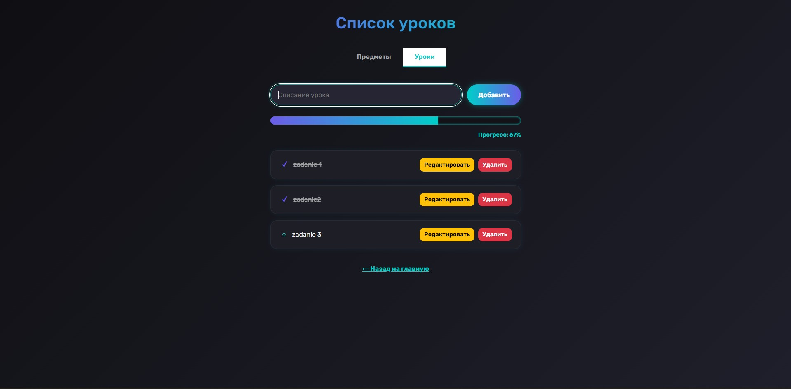

#Projekt: System Monitorowania Postępów w Nauce

## Autor: Kachan Ostap 54637 L2

## Temat projektu i jego opis

Tematem mojego projektu jest: System monitorowania postępów w nauce - SMPN. Moim zdaniem aplikacja ta może być wygodna i przydatna dla szkół, gimnazjów czy uczelni wyższych gzie istnieje potrzeba śledzenia postępów i osiągnięć uczniów.

##Opis techniczny 
SMPN – aplikacja webowa która jest wykonana w języku JavaScript z użyciem Node.js oraz EJS jako szablonów dla tworzenie stron projektu. Projekt jest oparty i wykorzysta schemat architektoniczny MVC, dodatkowo są używane HTML i CSS dla szablonów EJS. 

## Aplikacja będzie dostępna pod adresem: http://localhost:3000

## Główne funkcji 
-  Dodawanie, przeglądanie, edycja oraz usuwanie przedmiotów – czyli tak zwane operacje typu CRUD
-  Dodawanie lekcji do przedmiotów
-  Wyświetlanie listy przedmiotów i ich postępów dla każdego ucznia 
- Możliwość oznaczania kolejnych etapów nauki

##  Wykorzystane biblioteki zewnętrzne

[express](https://www.npmjs.com/package/express) – obsługa serwera HTTP i routing

[ejs](https://www.npmjs.com/package/ejs) – silnik szablonów do SSR

##  Technologie
- Node.js – środowisko uruchomieniowe JavaScript
- Express.js – framework backendowy
- EJS – szablony HTML renderowane po stronie serwera
(SSR)
- HTML5 + CSS3 – wygląd i układ aplikacji- Bootstrap – responsywny i atrakcyjny design

## Wymagania do komputera:
- Node.js w wersji 16.x lub wyższej
- npm (Node Package Manager)
## Instalacja potrzebnych bibliotek 
Żeby zainstalować biblioteki które są będzie potrzebował projekt przy uruchomieniu projektu na innym komputerze należy wpisać: npm install

## 🖼️ Zrzuty ekranu aplikacji 
Strona główna z listą filmów


### Instalacja projektu

```bash
git clone https://github.com/comnotaDidi/MVC-Project.git
cd learning-tracker
npm install
node app.js
